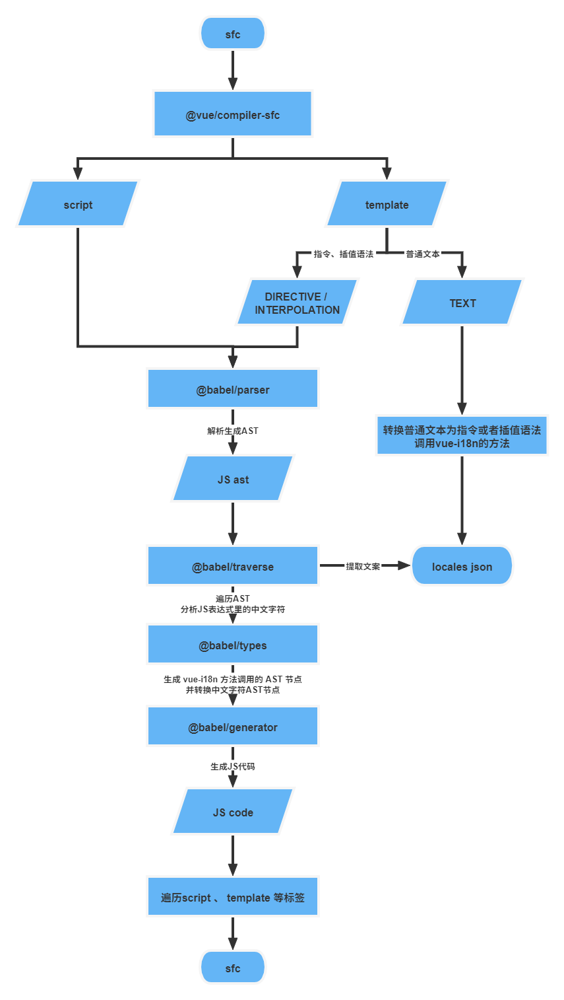

<h1 align="center">tvt</h1>
<p align="center">
  <a href="https://badge.fury.io/js/tvt"></a>
  <a href="https://github.com/wood3n/tvt/actions"></a>
</p>
<p align="center">
基于 NodeJS + TypeScript 实现的 CLI 工具，自动提取和转换 VUE 组件中的中文字符。
</p>

# 使用

## 安装

```bash
npm install -g tvt

or

yarn global add tvt
```

## 配置

使用`tvt`前，需要在命令运行目录的`package.json`下指定以下配置项：

| 配置项       | 类型     | <p wrap="no">必填项</p> | 默认值              | 含义                                                                                |
| ------------ | -------- | ----------------------- | ------------------- | ----------------------------------------------------------------------------------- | ------------------------------------------------------------------------ |
| `importPath` | `string` | 是                      | -                   | 指定在 VUE SFC 中自动中引入的`vue-i18n`对象的相对路径，详细见下文[路径配置](#alias) |
| `pattern`    | `string` | 否                      | `"**/*.vue"`        | [`node-glob`](https://github.com/isaacs/node-glob#glob-primer)匹配文件模式字符串    |
| `ignore`     | `string` | `string[]`              | 否                  | `["node_modules/**"]`                                                               | [`node-glob`](https://github.com/isaacs/node-glob#options)配置项`ignore` |
| `output`     | `string` | 否                      | `"i18n/zh-CN.json"` | 指定导出的中文 JSON 文件的路径                                                      |

```js
// 默认配置
const default = {
  pattern: "**/*.vue",
  ignore: ["node_modules/**"],
  output: "i18n/zh-CN.json"
};
```

<h3 id="alias">路径配置</h3>

`tvt`内部会处理在 VUE 组件的`script`内部的中文字符，为了兼容位于`export default {}` 外部中文字符的情况，采用直接引入`vue-i18n`对象的方式，所以必须指定从`vue-i18n`导出的对象的全局相对路径，建议使用`@`别名的路径解析方式，利用`webpack`的`resolve.alias`配置也十分的简单：

```js
const path = require("path");

module.exports = {
  //...
  resolve: {
    alias: {
      "@": path.resolve(__dirname, "./src"),
    },
  },
};
```

或者在`vue-cli`中：

```js
const path = require("path");
module.exports = {
  configureWebpack: {
    resolve: {
      alias: {
        "@": path.resolve(__dirname, "./src"),
      },
    },
  },
};
```

## vue-i18n 的拓展

鉴于目前`vue`国际化解决方案主要是`vue-i18n`，所以 `tvt`内部结合`vue-i18n`注入到组件中的对象来对 VUE 组件中的中文字符进行转换，不过使用前需要对`vue-i18n`导出的对象进行一些小小的改造。

一般来说，`vue-i18n`的使用在`<template>`内部主要通过`$t`这样注入的方法，同时每个 VUE 组件中也都会包含一个[`$i18n`](https://kazupon.github.io/vue-i18n/zh/api/#注入属性)对象，那么为了能够对在模板字符串内部的中文字符进行转换。那么我们对`$i18n`拓展出一个`tExtend`方法，用于处理在模板字符串内部中文字符的转换情况。

```js
import Vue from "vue";
import VueI18n from "vue-i18n";
import cn from "./cn.json";

Vue.use(VueI18n);
// 通过选项创建 VueI18n 实例
const i18n = new VueI18n({
  locale: "cn", // 设置地区
  fallbackLocale: "cn",
  messages: {
    cn,
  },
});

/**
 * 转换模板字符串内部%s字符的方法
 */
i18n.tExtend = (key, values) => {
  let result = i18n.t(key);

  if (Array.isArray(values) && values.length) {
    values.forEach((v) => {
      result = result.replace(/%s/, v);
    });
  }
  return result;
};

export default i18n;
```

### 示例

例如如下 SFC 内部的插值语法中包含一个 JS 模板字符串如下：

```vue
<template>
  <div>
    {{ `你的钱包余额：${money}` }}
  </div>
</template>

<script>
export default {
  data() {
    return {
      money: 10,
    };
  },
};
</script>
```

经`tvt`提取的中文为：

```json
{
  "9ef86bfdc5f84d52634c2732a454e3f8": "你的钱包余额：%s"
}
```

自动转换的结果为：

```vue
<div>
  {{ $i18n.tExtend('9ef86bfdc5f84d52634c2732a454e3f8', [money]) }}
</div>
```

## 实现

详细可见个人博客的文章解析 —— [国际化解决方案 - icodex](https://icodex.me/blog/vue国际化文案自动提取)


