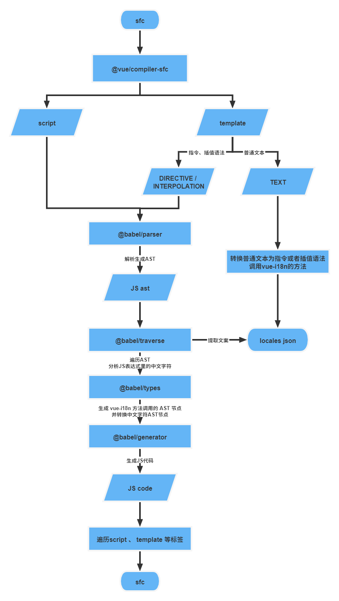

## 介绍

`sweet-i18n`提供全链路解决国际化问题的能力，从 CLI 工具一键提取多国语文案到服务端整合，更有 vscode 插件加持，开发效率 upupup！！！。


### AST 解析和遍历

CLI 内部会利用`@vue/compiler-sfc`和`@babel/parser`对`.vue`和`.js`文件进行转换成 AST 的形式，方便提取内部的中文字符。

对于`vue`的`mustache`语法内部的中文字符存在三种情况，直接递归遍历标签元素即可：

- 中文字符串子元素
- 标签内部的属性值
- `render`方法内部`JSX`标签的`JSXText`子元素

`JS`内部的中文字符两种情况，使用`@babel/traverse`进行遍历：

- 普通字符串
- 模板字符串

### AST 节点替换

对于`vue`的`mustache`语法生成的 AST 节点比较简单，可以直接手动生成并直接替换原节点，例如插值语法：

```typescript
function createInterpolationNode(content: string) {
  return {
    type: NodeTypes.INTERPOLATION,
    loc: {
      source: `{{ ${content} }}`,
    },
  };
}
```

对于`js`内部的方法等节点可以使用`@babel/types`生成，生成的节点使用`@babel/traverse`进行替换，例如生成`this.$t(xxx)`方法调用节点并替换：

```typescript
StringLiteral: {
	exit: path => {
    ...
    path.replaceWith(
      t.callExpression(
        t.memberExpression(t.thisExpression(), t.identifier("$t")),
        [t.stringLiteral(localeKey)]
      )
    );
  }
}
```

### AST 转换

对于`vue`的`mustache`语法直接递归遍历生成代码，而`js`代码使用`@babel/generator`生成。

### 解析流程

整个解析流程如下所示



## vscode插件

vscode 插件部分用于在开发过程中智能提示代码中经过替换的`key`值对应的中文文案，同时提供跳转到指定中文文案的能力。

## 翻译协作平台

翻译协作平台使用`nestjs`+`postgreSql`开发，用于管理历史翻译文案，筛选待翻译文案等，提升团队协作效率。


